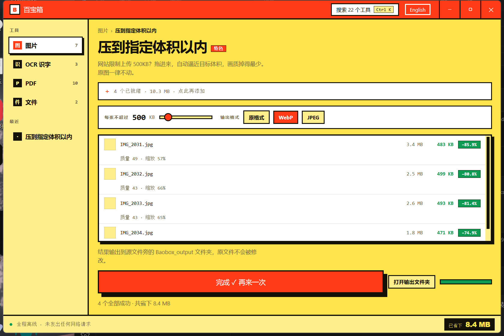

# Baobox 百宝箱

**A local file toolkit for Windows. No uploads, no limits, no network.**

[中文说明](#中文) · MIT · Windows 10/11



> ## 🚧 Preview — 58 of 59 tools work
>
> No release binary yet; build from source with the steps below. Everything
> marked ✅ has been run against real files and measured. Anything else says so
> inside the app rather than pretending to work.

---

## Why this exists

iLovePDF, Smallpdf and TinyPNG have enormous user bases and four problems in
common: your files get uploaded to someone else's server, free tiers cap size
and count, nothing works offline, and the pages are full of upsell.

The local alternatives are awkward in their own ways.
[Stirling-PDF](https://github.com/Stirling-Tools/Stirling-PDF) is excellent but
wants a Docker runtime, which rules it out for anyone who just needs to unlock
one PDF. Others have interfaces from a decade ago, or you install a separate
program per task.

**Baobox is one double-clickable app.** No Docker, no Java, no Python. Your
files never leave the machine because the binary has no HTTP client compiled
into it.

## What works today

### Images

| Tool | |
|---|---|
| **Compress to a target size** | ✅ Binary-searches quality, falls back to downscaling. TinyPNG gives you quality presets; upload forms enforce bytes. |
| **Strip EXIF privacy data** | ✅ Removes GPS and device metadata without re-encoding pixels |
| Batch compress · Convert format · Batch resize | ✅ Drop a whole folder; it recurses |
| **Redact** | ✅ Overwrites pixels rather than covering them |
| Watermark | ✅ Chinese included, tiled or single |
| **Split into a grid** | ✅ Crops to a centre square first, numbers the pieces in posting order |
| **Stitch into one long image** | ✅ Widths matched to the narrowest, scaling down only |
| Trim solid borders · Rounded corners · Crop to a ratio | ✅ |
| Adjust colour · Build an ICO · Dominant colours · Base64 | ✅ |
| Expand the canvas · GIF split and build | ✅ |

### OCR — free, offline, no subscription

iLovePDF and Smallpdf put OCR behind a paid plan. Windows already ships an
engine that is [faster and more accurate than Tesseract](https://transloadit.com/devtips/recognize-text-in-images-ocr-in-rust/),
so this costs nothing and adds no bytes.

| Tool | |
|---|---|
| Extract text from image | ✅ 77 ms per image |
| Batch OCR to one transcript | ✅ |
| Screen-capture OCR | ✅ `Ctrl+Shift+S` from any application — raises the window, grabs the desktop, drag to pick a region |
| **Scanned PDF → searchable** | ✅ Under PDF. The page looks identical; the words go underneath it |

### PDF

| Tool | |
|---|---|
| Merge · Split · Rotate · Extract text · Image→PDF | ✅ |
| **Make a scan searchable** | ✅ Invisible text layer over the page — search, select, copy |
| **Compress** | ✅ 33% off a 148 MB sample of real coursework |
| **Extract embedded images** | ✅ Copied out as stored, not re-encoded |
| Reverse page order · Delete or keep pages | ✅ Ranges like `1,3,5-8` |
| **Strip metadata** | ✅ /Info and the separate XMP copy |
| Trim page margins | ✅ Changes the crop box only, so it is reversible |
| N pages per sheet · Insert blank pages | ✅ |
| **Repair a broken PDF** | ✅ Rebuilds the index; falls back to images only as a last resort, and says so |
| **PDF→image** | ✅ Uses the Windows rendering engine, so no 11 MB pdfium DLL |
| **Chinese watermark & page numbers** | ✅ Font subsetting: 19.7 MB font → 13.5 KB embedded |
| Unlock restrictions | ✅ Clears print/copy locks; open passwords need the password |
| Set a password | ❌ Deliberately not built — [see below](#what-is-deliberately-missing) |

### Files

| Tool | |
|---|---|
| **Find duplicates** | ✅ Compares content, not names. Protects files a program depends on. |
| **Batch rename** | ✅ Stackable rules, live preview, undo log |
| **Fix mojibake** | ✅ Detects GBK/Big5 and converts to UTF-8, using Firefox's detector |
| **Simplified ↔ Traditional** | ✅ Phrase-level tables — 头发→頭髮 but 发展→發展 |
| **QR codes** | ✅ Generate one per line of a file; read them back out of images |
| Find and replace · Directory tree | ✅ Regex supported; encoding detected |
| Split and rejoin large files | ✅ Byte-identical round trip, verified |
| Dedupe, sort, count lines · CSV ↔ JSON · Shift timestamps | ✅ |
| **Extract archives, repairing mangled names** | ✅ GBK entry names that Windows itself destroys |
| Create folders from a list | ✅ |
| File checksum | ✅ SHA-256 or BLAKE3, read in chunks |

## Measured, not estimated

**Compress to a target size** — four synthetic photos chosen to be hard to
compress, WebP output:

| Target | Under target | Slowest file |
|---|---|---|
| ≤ 500 KB | 4 / 4 | 4.7 s (4000×3000) |
| ≤ 200 KB | 4 / 4 | 3.4 s |
| ≤ 100 KB | 4 / 4 | 2.7 s |

A first implementation took 44 s on the largest file by re-encoding at full
resolution on every probe. Estimating the initial downscale from the area ratio
in one step brought that to 4.7 s.

**PDF parsing** — 1070 real PDFs off a working machine: 1030 parsed (96.3%),
27536 pages, 10.1 s total, slowest file 759 ms. All 40 failures were genuinely
malformed.

**PDF compression** — 12 real documents, 148.5 MB → 99.4 MB (33%). Every output
re-opened and page-counted; none broken, none larger.

**Duplicate detection** — 338190 files scanned in 8.9 minutes. Sampled pairs
byte-compared: zero false matches.

## Working with it

Drop files anywhere in the window and it flips to the matching section —
PDFs to the PDF tools, images to the image tools — then whichever tool you
pick receives them. It identifies the type but does not guess the verb: one
PDF could be a merge, a compress or a render, and jumping straight into one
of those would be presumptuous.

Folders work too, recursively. Rows can be removed or reordered where order
matters. Long batches can be stopped, and finished work is kept. Output goes
beside each source file by default; you can point it somewhere else and that
choice is remembered.

`Ctrl+K` searches all 59 tools. `Ctrl+Shift+S` grabs text off the screen from
inside any other application.

## Rules the code actually follows

1. **Originals are never modified.** Output goes to a new folder. Verified by
   SHA-256 comparison before and after every acceptance run.
2. **Deletion goes to the Recycle Bin**, never an unlink. Confirmation lists
   every path, warns when a duplicate set would be wiped entirely, and starts
   with focus on Cancel.
3. **Identical is not the same as safe to delete.** A full-drive scan reported
   115 GB reclaimable, led by CUDA runtimes duplicated across conda
   environments and a Git object. Files owned by a package manager, virtualenv,
   repository or installed program are labelled, kept, and excluded from the
   reclaimable figure.
4. **Cloud placeholders are skipped.** Reading a OneDrive or WPS placeholder
   downloads it. A tool for reclaiming space has no business pulling gigabytes
   back down to compare them.
5. **No network capability.** No HTTP is compiled in and the CSP permits no
   remote origins. Pull the cable; everything still works. The app will print
   its actual policy for you — click "Fully offline" in the status bar. That
   text is injected from the build config rather than retyped into the
   interface, so it cannot drift into being a comfortable lie.
6. **A folder you choose is not ours to overwrite.** Our own output folder
   replaces same-named files from a previous run, or repeating a batch would
   leave three copies of everything. A folder you picked may already contain
   your files, so names are suffixed there instead. Both directions are
   covered by tests.
7. **The savings counter does not flatter itself.** It counts only operations
   whose output can replace the original — compression, conversion, resizing,
   EXIF stripping, and duplicates actually deleted. OCR, merging and
   watermarking produce something new rather than a replacement and are
   excluded. Click the figure and it will tell you this itself, including that
   your originals are still on disk.

## What is deliberately missing

**Setting a PDF password.** `lopdf` can decrypt but not encrypt. A hand-rolled
PDF encryption that gets any detail wrong hands you a file that claims to be
protected while offering none — worse than not offering the feature. Waiting on
a vetted implementation.

**PDF → Word.** Needs LibreOffice (400 MB) or a commercial SDK. Driving an
installed copy of Word over COM was tried and abandoned: Word's PDF-reflow
dialog hangs headless calls, and suppressing it means writing to your Word
registry settings.

## Size

| | |
|---|---|
| Installer | **3.2 MB** |
| Installed | 10.6 MB |
| Memory in use | ~23 MB |

For comparison: Stirling-PDF needs a Docker runtime, and an Electron build of
the same feature set starts around 150 MB.

## Known rough edges

- **No code signing.** SmartScreen will warn about an unknown publisher. A
  certificate costs several hundred dollars a year. Releases carry SHA-256
  checksums so you can at least verify what you downloaded.
- **Antivirus false positives are likely.** A small Rust binary that reads and writes files in bulk
  and captures the screen looks suspicious to heuristics.
- **Windows only, on purpose.** OCR uses the WinRT engine and PDF rendering uses
  `Windows.Data.Pdf`. Neither has a cross-platform equivalent that stays this
  small.

## Build

```bash
npm install
npm run tauri build
```

Needs Rust with the MSVC toolchain, Node 22+, and Visual Studio C++ build tools.

## Licence

MIT. Dependency audit in [LICENSES-THIRD-PARTY.md](LICENSES-THIRD-PARTY.md) —
599 crates, no copyleft obligations. Ghostscript was avoided specifically
because it is AGPL.

---

<a name="中文"></a>

# 中文

**一个 Windows 本地文件工具箱。不上传、无限制、不联网。**

> ## 🚧 预览版 —— 59 个工具中 58 个可用
>
> 暂无预编译版本，请按下方步骤自行构建。标 ✅ 的都拿真实文件跑过并留有实测数据；
> 其余的在软件里会明说自己还没做好，不会假装能用。

## 为什么做这个

iLovePDF、Smallpdf、TinyPNG 用户量巨大，但有四个共同问题：文件要传到别人服务器、
免费版限体积限数量、断网就废、满屏诱导付费。

本地替代品也不省心。[Stirling-PDF](https://github.com/Stirling-Tools/Stirling-PDF)
很强但要跑 Docker——只想解锁一份 PDF 的人根本不会装。其余的要么界面停在十年前，
要么一个功能装一个软件。

**Baobox 就是一个双击能开的程序。** 不需要 Docker、Java 或 Python。
你的文件不会离开这台电脑——因为这个二进制里压根没编进 HTTP 客户端。

## 三个差异化的点

- **OCR 免费**。iLovePDF 和 Smallpdf 把 OCR 锁在付费订阅里。Windows 自带的引擎
  比 Tesseract 更快更准，调它零成本、零体积。
- **压到指定体积**。网站限制上传 500KB 是刚需，而 TinyPNG 只能调质量档位。
- **中文该有的功能**。中文水印和页码需要把字体嵌进 PDF，而微软雅黑 19.7 MB
  且受版权保护不能分发——子集化后只占 13.5 KB。九宫格切图、长图拼接、GBK 乱码修复
  这几件事中文社区天天在用，欧美的同类工具普遍不做。

## 怎么用

文件直接拖到窗口任意位置，会自动翻到对应的支柱——PDF 翻到 PDF，图片翻到图片——
之后点哪个工具，文件就跟到哪个。它只认类型不替你猜动作：一份 PDF 你可能想合并、
想压缩、想转图片，直接跳进其中一个是自作聪明。

文件夹也能拖，会递归展开。行可以单独移除，顺序影响结果的工具可以上下调。
批量跑到一半能停，已完成的产物保留。产物默认落在源文件旁边，也可以指定别的位置，
选过就记住。

`Ctrl+K` 搜全部 22 个工具。`Ctrl+Shift+S` 在任何别的软件里都能唤起截图取字。

## 代码真正遵守的规矩

1. **绝不修改原文件**，结果一律写入新目录。每次验收都用 SHA-256 比对确认过。
2. **删除只进回收站**，永不永久删除。确认框列出每一条路径，整组被勾选时单独警告，
   默认焦点在「取消」。
3. **内容相同不等于可以删。** 全盘扫描报出 115 GB「可回收」，但榜首是 conda 环境里
   重复的 CUDA 运行库和 Git 内部对象——删任何一份，环境就废、仓库就坏。这类文件会
   标明归属、强制保留，且**不计入可回收数字**。
4. **跳过云端占位文件。** 读 OneDrive / WPS 的占位符会触发下载。一个用来腾空间的
   工具，没道理把云端几个 GB 拉回本地来做比对。
5. **零网络能力。** 拔掉网线，所有功能照常。点左下角「全程离线」，它会把程序真实的
   内容安全策略贴给你看——那段文字是构建时从配置里读出来的，不是在界面上手抄一份，
   所以不会哪天改了配置忘了改文案，把一句空话留在那儿。
6. **你自己指定的输出目录不归我们覆盖。** 我们自建的 `Baobox_output` 里同名产物会替换
   （不然同一批跑三遍堆出三份），但你挑的文件夹里可能本来就有你的东西，一律加后缀。
   两个方向都有测试卡着。
7. **「已省下」不给自己脸上贴金。** 只算产物能直接替换原件的操作；OCR、合并、加水印
   产出的是新东西不是替换，一概不计。点那个数字它会自己说清楚，包括「原图还在磁盘上，
   这是换掉原件能省多少，不是已经空出来的量」。

## 已知的粗糙之处

- **没有代码签名**，SmartScreen 会提示「未知发布者」。证书每年几百美元。
  发布包会附 SHA-256 校验值，至少能确认下载的东西没被掉包。
- **国内杀软大概率误报**。小体积 Rust 程序 + 批量文件操作 + 全局热键，
  在启发式检测眼里就是可疑组合。
- **只做 Windows**，这是刻意的。OCR 用 WinRT 引擎，PDF 渲染用 `Windows.Data.Pdf`，
  跨平台方案都做不到这个体积。

## 授权

MIT。依赖审查见 [LICENSES-THIRD-PARTY.md](LICENSES-THIRD-PARTY.md)——
599 个依赖，无任何传染性许可证。PDF 压缩刻意没用 Ghostscript，因为它是 AGPL。
